# How to Add Your Data Set

This document outlines the process on how to upload your data set(s) to the website
:::note
**Make sure you've read the previous document to verify you have completed all the prerequisites required for certifying data.**

:::

This tutorial features two ways to upload your set: Desktop version and web version. <br/>
Click one of the following to choose your process:

[Web Version(Fastest route)](uploadinstructions#web-version)

[Desktop/Local Version](uploadinstructions#local-version)

## Web Version
This version just requires you to have your markdown files downloaded.

### Navigate to the alchemy repository
To begin, navigate to the alchemy repository.

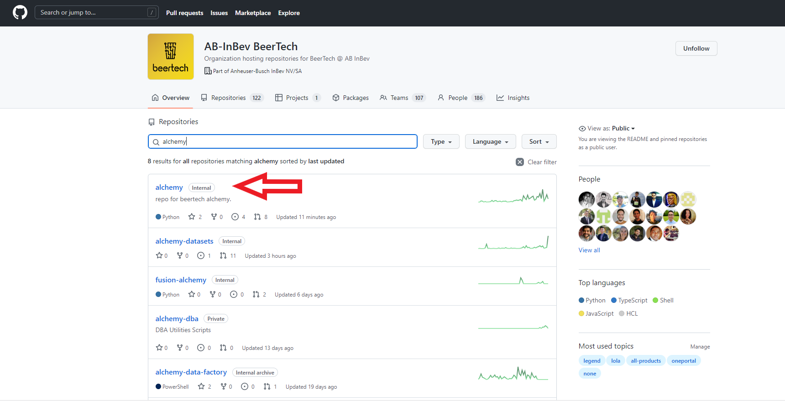

Once here click the tab that says "main" and create your own branch in the "find or create a branch" text box. This name can be whatever you may choose. For this example, I have created website_test.

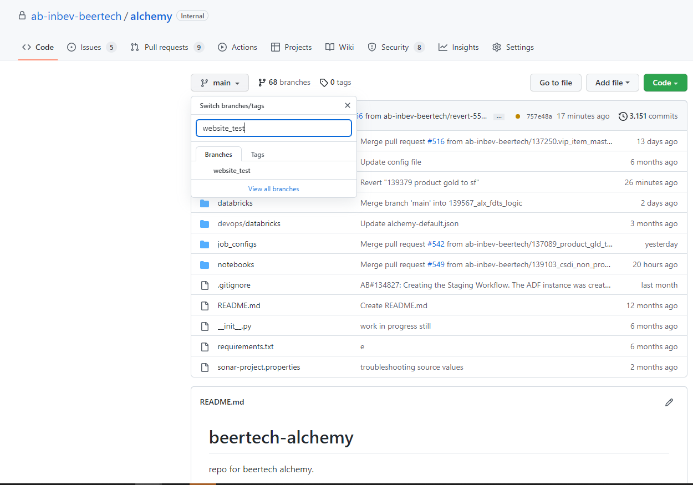

### Document placement
Once your branch has been created navigate into the "alchemy_website" folder

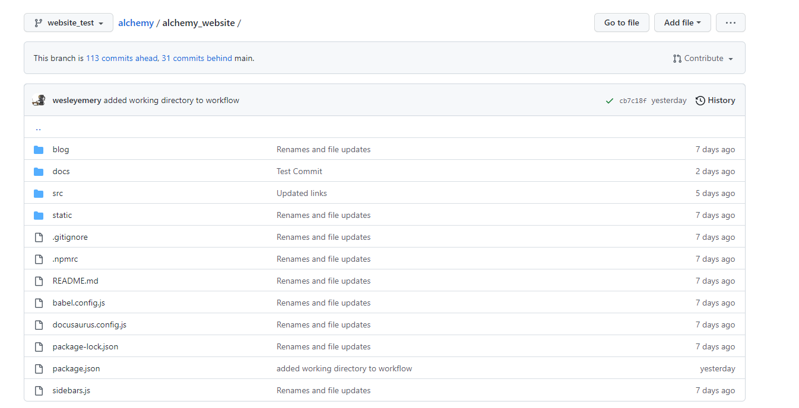

From here navigate into the "docs" folder and then into the "certified-sets" folder. 

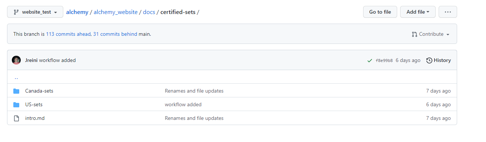

Then choose if you want to add a Canada set or US set and go into that folder. <br/>

From here click "Add file" at the top right and choose "upload files" from the drop down list. 

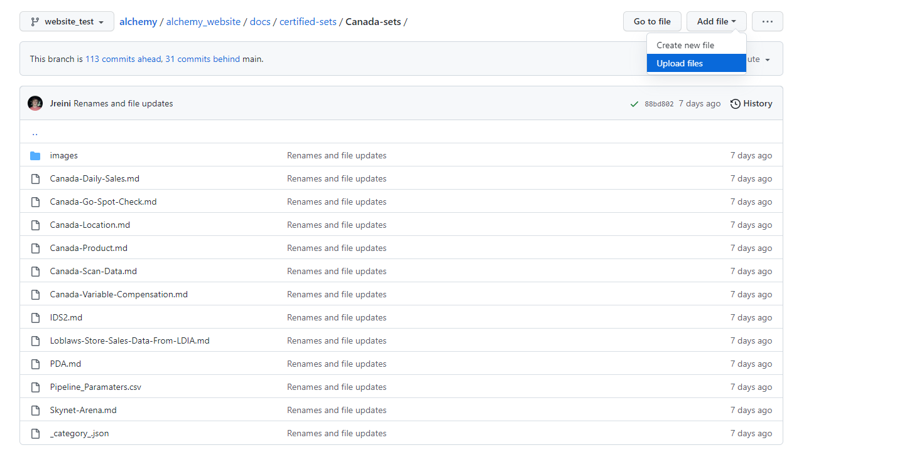

Now choose your file from your local machine and write a commit message such as "Adding a new Canada set".

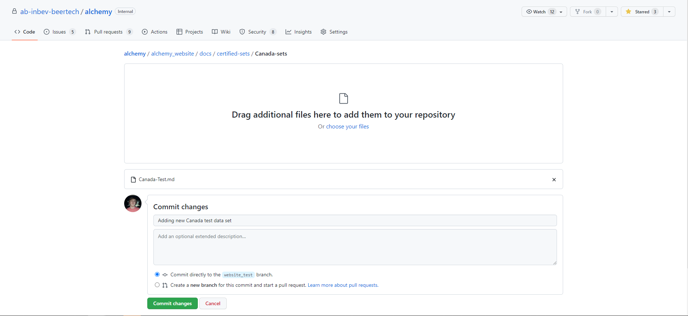
From here click commit and it should add the data set to your branch

### Merge to main
Now you should see a new message at the top:

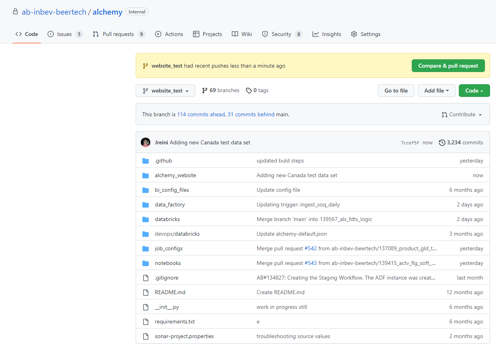

From here you want to click "Compare and Pull request". It will create a pull request to add your set into the website. Fill out the correct information then click "Create pull request". All you need to do now is to contact two alchemy developers to approve the changes and once that is done you want to click the merge button when it allows you to.

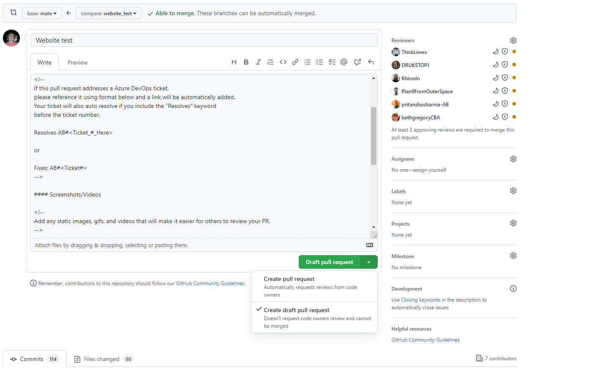

Congratulations, Your data set has been officially added.

## Local Version

### Setting up
This tutorial requires you to have a local device with git installed as well as your data set markdown files downloaded.
### Clone the Alchemy repository
To begin, navigate to the alchemy repository inside the AB-InBev BeerTech organization. You can do this by clicking the GitHub link in the top right corner.


From there click on the green "Code" button and copy the https link.

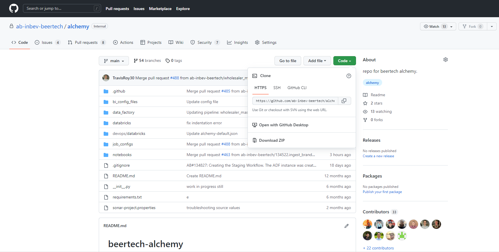

Now from here, enter your computer's terminal or use your IDE's terminal. <br/>
(For this tutorial, I will be using VScode's terminal)

Now enter the following git command to clone the repository:
```
git clone <enter link here>
```
or if its not pasting properly, enter this command:
```
git clone https://github.com/ab-inbev-beertech/alchemy.git
```
After authenticating your account, you should have successfully cloned the repository and you now want to navigate into the folder titled "Alchemy" and then into a folder titled "alchemy_website"

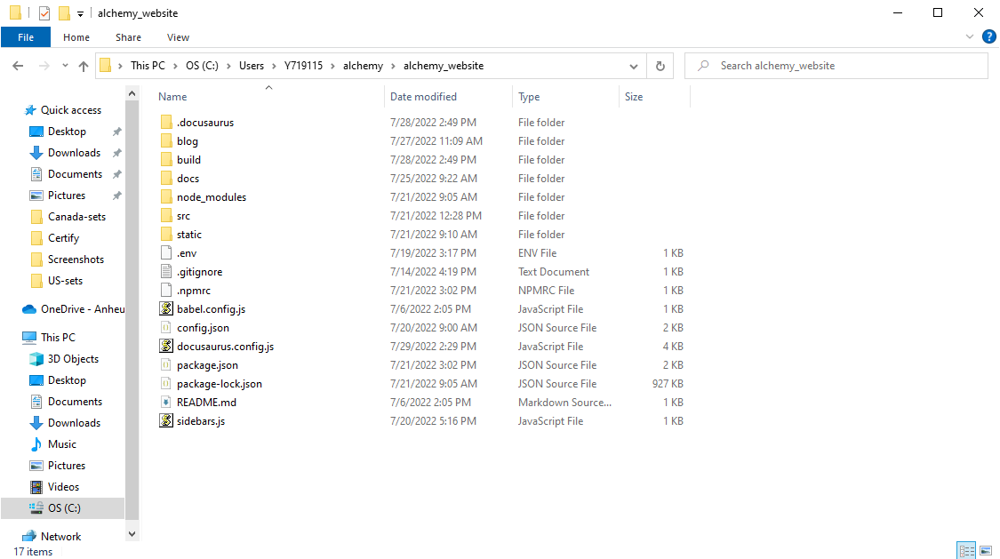

### Document upload process
:::note
**If you are going to publish multiple sets, it's best to put them all in at once to avoid having to create multiple Pull Requests**

:::

### Check for latest version
To begin, navigate to the alchemy repository in your terminal. Then execute the command:
```
git switch main
```
followed by:
```
git pull
```
This will make sure that you're up to date with the latest version of the alchemy repository.

### Create or enter your branch

:::note
**If you are struggling with using git commands, read all the basic commands [here](https://dev.azure.com/abi-ghq-audit-dsc-dev-ops/beer_tech/_wiki/wikis/beer_tech.wiki/5895/GitHub-Training)**

:::
To add your data set, first create enter your branch. If it's your first time making a branch type:

```
git checkout -b <your_branch_name>
```

if not, type:
```
git checkout <your_branch_name>
```

If done successfully, you should see this: <br/>
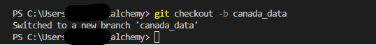

### Adding the data sets
:::note
**Before adding your set, verify it meets the website's standards in the following document ["Data Set Requirements"](requirements.md)**

::::

From here, you will want to go into your computer's specific file system and copy your markdown files into their correct folder. Be sure to keep the terminal open for the next step.

For example: If you have a Canada set you want to go down the following path:
```
alchemy\alchemy_website\certifed-sets\Canada-sets
```
**Don't forget to add any corresponding images to the proper images folder where the data set is stored**

### Locally check for errors
In your terminal, enter the "alchemy_website" folder and run the following command to first install the dependencies:
```
npm install
```

Once installed run the next command to build the website up with your changes:
```
npm run build
```

If it builds successfully then run the following command to view the website and check if the data set appears and works properly:
```
npm run serve
```

### Commit and push
After adding your data set, you want to go back to the terminal and execute the following commands:
```
git add *
```
This will track your files so they will be added to your branch. Now type the command:
```
git commit -m "added <data set(s)>"
```
Putting in a message will help verify that you've successfully added your data set(s).

Finally, to push your local changes to the server type:
```
git push
```
### Pull request
Once your push has successfully gone through, navigate to your branch on the GitHub website. This can be done by going to the alchemy repository and clicking on the "main" button on the top left.

For example, I will navigate to my branch: website.
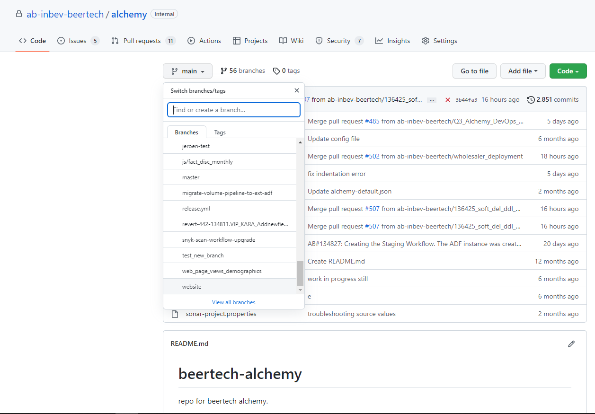

From there, create a pull request by clicking "Pull requests" on the top left, then click "New pull request" and change the compare from main to your branch. For example, here is me trying to merge to main:

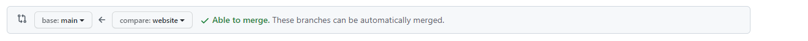

Then click create pull request.

For now, fill out the base template and then request for a review. After the review passes, click "merge pull request" and your data sets should now be on the website!
