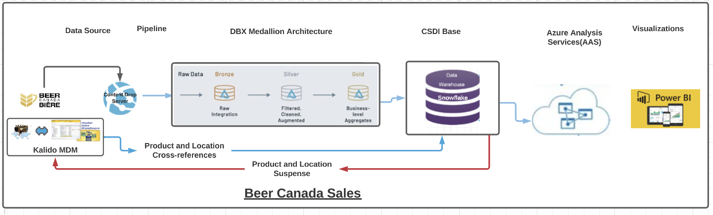
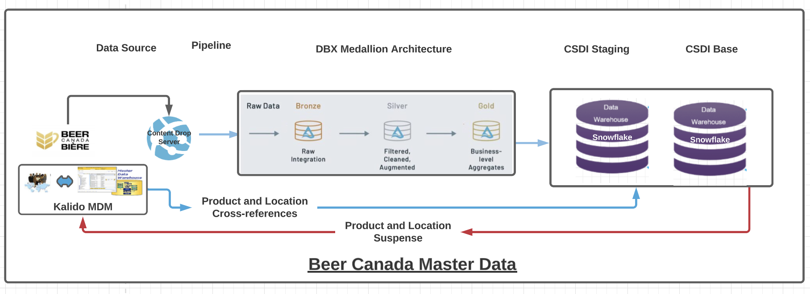
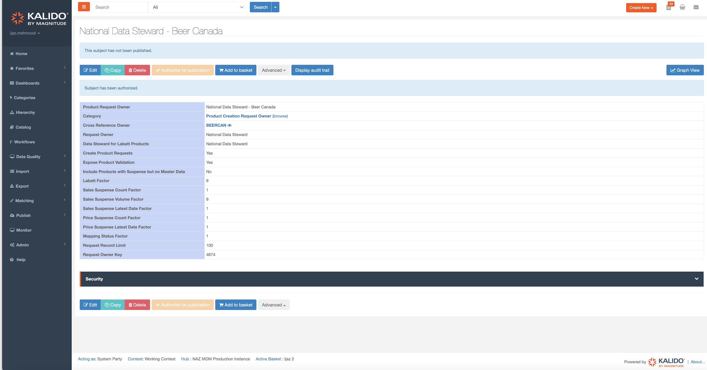

# Beer Canada Sales

## Overview
Beer Canada is a trade association representing beer makers in Canada. Its stated mission is to "provide thoughtful leadership and strategic focus to grow the beer category and facilitate the commercial success of Canada's brewers.”
Beer Canada provides Industry level data for all the SKUs from the participating brewers.

## Data Architecture

## Data Ingestion
### Source File Details:

Beer Canada provides sales file for each month containing data for last 3 months.
The file is provided at below SFTP location and informed to national SI team and GCC team.

_Server:_ contentdrop.anheuser-busch.com 
Path: /IBS_HOME/IDS/Inbound

Column Name|Description	
-|-	
PROVINCE_ID|a unique 2 char field identifying a Canada or a province. Values: CN (for national data) or BC, AB, SK, MB, ON, QC, NB, PE, NS, NL, NU, NT, YT, if provincial data are provided.
DATE|the month date for the data. Format: mmm-dd-yyyy, with value = last day of month, including e.g. Feb-29-2016 for leap year.
DATE_TYPE|1 = month.
PRODUCT_ID|the unique Beer Canada identifier of a particular product or SKU: numeric, long integer. This key will stay constant over time.
PRODUCT_NAME|a literal description of the product or SKU, e.g. “Moosehead Lager 6 bottles 341 ml”, 50 char max.
TYPE_OF_SALE_ID|a unique identifier of a particular type of sale: numeric, byte. Values: 1- Off Premise, 2 = On Premise, 3 = Combined, 20 = Total.
CHANNEL_ID|the unique identifier of a particular channel: e.g. direct delivery, brewery retail store, total (for markets in which no channel differentiation is available): numeric, byte. Values: 20|total.
BRAND_ID|the unique Beer Canada identifier of a particular brand: numeric, integer. This key will stay constant over time.
BRAND_NAME|a literal description of the brand, e.g. “Rickards Red”, 50 char max.
BEER_TYPE_ID| the unique byte identifier of a beer type, 1 = ALE, 2 = MALT, 3 = LAGER, etc.
CONTAINER_ID|the unique byte identifier of a particular container, 1 = Bottle, 2 = Can, 3 = Keg, 9 = Total.
UNIT_COUNT|contains the number of containers in a product, e.g. for 6 bottles, 341 ml, the value would be 6. Numeric, long integer.
UNIT_VOLUME|contains the total volume in ml of the product, e.g. for 6 bottles, 341 ml the value would be 2046. Numeric, long integer.
BREWER_NAME|a literal description of the brewer, e.g. “Labatt”, 50 char max.
DOMESTIC_IMPORT|indicates whether the SKU is domestic (D) or import (I), 1 char.
COUNTRY|indicates the country of origin of the SKU, 50 char.
ALL_IN_ID|indicates the brewing ownership or control of the SKU, numeric, long integer.
ALL_IN_NAME|indicates the name of the All-In entity, 30 char. Examples: Labatt, MolsonCoors, Sleeman, Moosehead.
VOLUME|the volume of the sales for this record, in hectolitres (hl), five decimal places. Numeric, double.
 

### Bronze Layer:
Table: [bronze.ca_beercan_sls](https://adb-6406091976575681.1.azuredatabricks.net/explore/data/hive_metastore/bronze/ca_beercan_sls?o=6406091976575681)

Column Name|Type|Description	
-|-|-
PROVINCE_ID|string|Province ID
MONTH_DATE|string|Month Date
DATE_TYPE|string|Date Type
PRODUCT_ID|string|Product ID
PRODUCT_NAME|string|Product Name
TYPE_OF_SALE_ID|string|Type Of Sales ID
CHANNEL_ID|string|Channel ID
BRAND_ID|string|Brand ID
BRAND_NAME|string|Brand Name
BEER_TYPE_ID|string|Beer Type ID
CONTAINER_ID|string|Container ID
UNIT_COUNT|string|Unit Count
UNIT_VOLUME|string|Unit Volume
BREWER_NAME|string|Brewer Name
DOMESTIC_IMPORT|string|Domestic or Import Flag
COUNTRY|string|Country
ALL_IN_ID|string|All in ID
ALL_IN_NAME|string|All in Name
VOLUME|string|Volume
EDW_LOAD_FILENAME|string|EDW Load File Name
EDW_START_TSP|timestamp|EDW Start Time Stamp

### Silver Layer:

Table: [silver.ca_beercan_sls](https://adb-6406091976575681.1.azuredatabricks.net/explore/data/hive_metastore/silver/ca_beercan_sls?o=6406091976575681)

Column Name|Type|Description	
-|-|-
PROVINCE_ID|string|Province ID
MONTH_DATE|Date|Month Date
DATE_TYPE|string|Date Type
PRODUCT_ID|string|Product ID
PRODUCT_NAME|string|Product Name
TYPE_OF_SALE_ID|string|Type Of Sales ID
CHANNEL_ID|string|Channel ID
BRAND_ID|string|Brand ID
BRAND_NAME|string|Brand Name
BEER_TYPE_ID|string|Beer Type ID
CONTAINER_ID|string|Container ID
UNIT_COUNT|string|Unit Count
UNIT_VOLUME|string|Unit Volume
BREWER_NAME|string|Brewer Name
DOMESTIC_IMPORT|string|Domestic or Import Flag
COUNTRY|string|Country
ALL_IN_ID|string|All in ID
ALL_IN_NAME|string|All in Name
VOLUME|string|Volume
EDW_LOAD_FILENAME|string|EDW Load File Name
EDW_START_TSP|timestamp|EDW Start Time Stamp

### Gold Layer:
Table: [gold.ca_beercan_fct_ext_sls](https://adb-6406091976575681.1.azuredatabricks.net/explore/data/hive_metastore/gold/ca_beercan_fct_ext_sls?o=6406091976575681)
Column Name|Type|Description	
-|-|-
DT_SK|int|Surrogate Key on Date
SLS_SRC_SK|int|Surrogate Key on Sales Source
PREM_SK|int|Surrogate Key on Premise
SLS_SUB_CH_SK|int|Surrogate Key on Sales Sub Channel
EXT_LOC_DIST_XREF_CODE|string|External Location Distribution Cross-reference Code
PHF_LOC_DIST_SLS_TYP_ID|string|Physical Location Distribution Cross-reference Type ID
EXT_LOC_XREF_CODE|string|External Location Cross-reference Code
PHF_LOC_SLS_TYP_ID|string|Physical Location Sales Type ID
EXT_PROD_XREF_CODE_1|string|External Product Cross-reference Code 1
EXT_PROD_XREF_CODE_2|string|External Product Cross-reference Code 2
EXT_PROD_XREF_CODE_3|string|External Product Cross-reference Code 3
SLS_TRAN_TYP_XREF_CODE|string|Sales transaction Type Cross-reference Code
SLS_VOL|double|Sales Volume
SLS_UOM_CODE|string|Sales Unit of Measure Code
SLS_UNIT_PRC|int|Sales Unit Price
EDW_LOAD_FILENAME|string|EDW Load File Name
EDW_START_TSP|timestamp|EDW Start Time Stamp

## Master Data Architecture

### Snowflake Landing  Objects:
 #### Tables:  [CSDI_EXT_S.BEERCAN_PRODUCT_LIST](https://app.snowflake.com/east-us-2.azure/abinbev_naz/#/data/databases/ABI_WH/schemas/CSDI_EXT_S/table/BEERCAN_PRODUCT_LIST/columns)
 #### Views: [CSDI_EXT.BEERCAN_PRODUCT_LIST](https://app.snowflake.com/east-us-2.azure/abinbev_naz/#/data/databases/ABI_WH/schemas/CSDI_EXT/table/BEERCAN_PRODUCT_LIST/columns), [CSDI_V.REF_BEERCAN_PRODUCT_LIST](https://app.snowflake.com/east-us-2.azure/abinbev_naz/#/data/databases/ABI_WH/schemas/CSDI_V/table/REF_BEERCAN_PRODUCT_LIST/columns)

Column Name|Type|Description	
-|-|-
PRODUCT_ID|VARCHAR(16777216)|Product|ID
PRODUCT_NAME|VARCHAR(16777216)|Product Name
BRAND_ID|VARCHAR(16777216)|Brand ID
BRAND_NAME|VARCHAR(16777216)|Brand Name
BEER_TYPE_ID|VARCHAR(16777216)|Beer Type ID
CONTAINER_ID|VARCHAR(16777216)|Container ID
UNIT_COUNT|VARCHAR(16777216)|Unit Count
UNIT_SIZE|VARCHAR(16777216)|Unit Size
BREWER_NAME|VARCHAR(16777216)|Brewer Name
DOMESTIC_IMPORT|VARCHAR(16777216)|Domestic Import
COUNTRY|VARCHAR(16777216)|Country
ALL_IN_ID|VARCHAR(16777216)|All in ID
ALL_IN_NAME|VARCHAR(16777216)|All In Name
EDW_START_TSP|TIMESTAMP_NTZ(9)|Date and time of last update in Beer Canada Product table

## Product Automation 

### Views:  [CSDI.REF_EXT_PROD_LIST](https://app.snowflake.com/east-us-2.azure/abinbev_naz/#/data/databases/ABI_WH/schemas/CSDI/table/REF_EXT_PROD_LIST/columns)

Column Name|Type|Description	
-|-|-
XREF_OWNR_CODE|VARCHAR(4)|Cross Reference Owner Code
XREF_OWNR_SK|NUMBER(38,0)|Cross Reference Surrogate Key 
EXT_PROD_XREF_CODE_1|VARCHAR(256)|External Cross Reference Code 1
EXT_PROD_XREF_CODE_2|VARCHAR(256)|External Cross Reference Code 2
EXT_PROD_XREF_CODE_3|VARCHAR(256)|External Cross Reference Code 3
EXT_PROD_NAME|VARCHAR(300)|External Product Name
PROD_CAT_CODE_1|VARCHAR(256)|Product Category 1
PROD_CAT_CODE_2|VARCHAR(256)|Product Category 2
PROD_CAT_CODE_3|VARCHAR(256)|Product Category 3
PROD_CAT_CODE_4|VARCHAR(256)|Product Category 4
EXT_BRWR_CODE|VARCHAR(256)|External Brewer Code
EXT_BRWR_NAME|VARCHAR(300)|External Brewer Name
EXT_BRD_CODE|VARCHAR(256)|External Brand Code
EXT_BRD_NAME|VARCHAR(256)|External Brand Name
EXT_PROD_TYP|VARCHAR(256)|External Product Type
EXT_ALCHL_CNTN|VARCHAR(256)|External Alcohol Content
EXT_PKG_CODE|VARCHAR(256)|External Package Code
EXT_PKG_NAME|VARCHAR(256)|External Package Name
EXT_PKG_UOM|VARCHAR(256)|External Unit of Measure
EXT_PKG_CNT|VARCHAR(256)|External Package Count
EXT_CONT_TYP|VARCHAR(256)|External Container Type
EXT_CONT_RTRN|VARCHAR(256)|External Container Return
EXT_CONT_MATL|VARCHAR(256)|External Container Material
EXT_PKG_SZ|VARCHAR(256)|External Package Size
EXT_CONT_CNT_NBR|NUMBER(38,0)|External Container Count Number
EXT_INR_PKG_CONT_CNT_NBR|NUMBER(38,0)|External Inner Container Count Number
EXT_OTR_PKG_CONT_CNT_NBR|NUMBER(38,6)|External Outer Container Count Number
EXT_CONT_SZ_LIT|NUMBER(38,12)|External Container Size in Litre
EXT_UPC_CODE|VARCHAR(256)|External UPC Code
EXT_SCC_CODE|VARCHAR(256)|External SSC code
EXT_CSPC_CODE|VARCHAR(256)|External CSPC code
EXT_STATUS|VARCHAR(256)|External Status
EXT_LIST_DT|DATE|External List Date
EXT_DELIST_DT|DATE|External Delist Date
EXT_PRC|NUMBER(18,6)|External Price

## Product Creation Request Setup in MDM

Compiled by Ijaz Manhmood on April 12,2023
