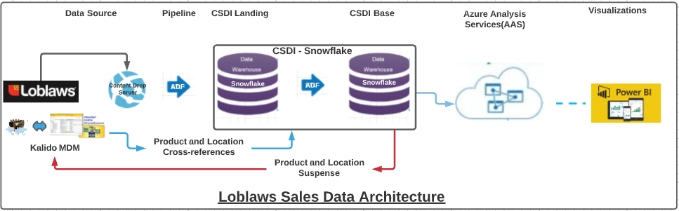
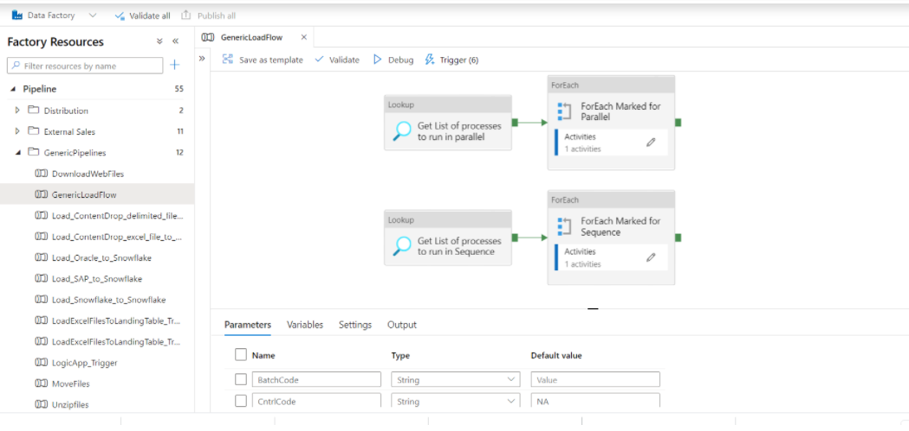

# Loblaws Store Sales Data From LDIA

## Data Architecture:

## Landing Objects:

### CSDI_EXT_S.LDIA_SALES

|**Column Name**|**Data Type**|**Comment**|
|--|--|--|
WEEK|TEXT|Week Number
PROMO_YEAR|TEXT|Promo Year
WEEK_END_DATE|TEXT|Week End Date
UPC_CODE|TEXT|UPC Code
ARTICLE_NUM|TEXT|Article Number
PACK_QTY|TEXT|Package Quatity
UNIT_SIZE|TEXT|Unit Size
SITE_NUM|TEXT|Site Number
SALES|TEXT|Sales Dollar Value
UNITS|NUMBER|Units Sold
SRC_FILE_NAME|TEXT|Source file name of the file holding the transaction
PRCSSD_FLG|TEXT|Processed flag <L\>anded and outstanding, <I\>gnored for load, <P\>rocessed to base, <R\>ejected on load, <D\>eleted
LAST_UPDATED_TSP|TIMESTAMP_NTZ|Date and time of last updated in landing by ETL

### CSDI_EXT_S.LDIA_STORE_MASTER

|**Column Name**|**Data Type**|**Comment**|
|--|--|--|
SITE_NUM|TEXT|Site Number
SITE_NAME|TEXT|Article Name
BANNER_NUM|TEXT|Banner Number
BANNER_NAME|TEXT|Banner Name
DIV_CODE|TEXT|Division Code
DIV_DESC|TEXT|Division Description
SITE_ADD|TEXT|Site Address
CITY|TEXT|City
PROVINCE|TEXT|Province
POST_CODE|TEXT|Site Postal Code
SALES_ORG_NUM|TEXT|Sales Org Num
SALES_ORG_DESC|TEXT|Sales Organization Description
SRC_FILE_NAME|TEXT|Source file name of the file holding the transaction
PRCSSD_FLG|TEXT|Processed flag <\L>anded and outstanding, <I\>gnored for load, <P\>rocessed to base, <R\>ejected on load, <D\>eleted
LAST_UPDATED_TSP|TIMESTAMP_NTZ|Date and time of last updated in landing by ETL

### CSDI_EXT_S.LDIA_ITEM_MASTER

|**Column Name**|**Data Type**|**Comment**|
|--|--|--|
UPC_CODE|TEXT|UPC Code
ARTICLE_NUM|TEXT|Article Number
UPC_DESCRIPTION|TEXT|UPC Description
PACK_QTY|TEXT|Pack Qty
UNIT_SIZE|TEXT|Unit Size
BUOM|TEXT|Unit Of Measure
SUPER_DEPT_CODE|TEXT|Super Department Code
SUPER_DEPT_DESC|TEXT|Super Department Description
DEPT_CODE|TEXT|Department Code
DEPT_DESC|TEXT|Department Description
SUB_DEPT_CODE|TEXT|Sub Department Code
SUB_DEPARTMENT_DESC|TEXT|Sub Department Description
SUP_CAT_CODE|TEXT|Super Category Code
SUPER_CATEGORY_DESC|TEXT|Super Category Description
CAT_CODE|TEXT|Category Code
CATEGORY_DESC|TEXT|Category Description
BRAND|TEXT|Brand
VNDR_NUM|TEXT|Vendor Number
VNDR_NAME|TEXT|Vendor Name
SRC_FILE_NAME|TEXT|Source file name of the file holding the transaction
PRCSSD_FLG|TEXT|Processed flag <\L>anded and outstanding, <I\>gnored for load, <P\>rocessed to base, <R\>ejected on load, <D\>eleted
LAST_UPDATED_TSP|TIMESTAMP_NTZ|Date and time of last updated in landing by ETL

## Landing and Base Pipelines
 

## Pipelines Parameters
  [LDIA-Pipelines-Parameters.csv](Pipeline_Paramaters.csv)
## Base Objects
            
### FCT_EXT_PRD_SLS

## Consumption Layer Objects

### [EDW.CSDI_FCT_WK_POC_SLS](https://app.snowflake.com/east-us-2.azure/abinbev_naz/data/databases/ABI_WH/schemas/EDW/view/CSDI_FCT_WK_POC_SLS)

The data in this view is an aggregate of weekly POC sales across multiple sales sources within the CSDI environment. Each source of sales is identified by a unique surrogate key found in the SLS_SRC_SK field which should be joined to the CSDI_REF_SLS_SRC view to retrieve the descriptive name of the source. The various sales metrics are populated in each record if these are applicable for the given source.

|Name|Data Type|Comment|
|--|--|--|
|WK_SK|NUMBER(38,0)|Week Surrogate Key|
|SLS_SRC_SK|NUMBER(38,0)|Sales Source Surrogate Key|
|POC_SK|NUMBER(38,0)|POC Surrogate Key|
|PHF_LOC_SCM_SK|NUMBER(38,0)|Physical Location (Distribution Centre) Surrogate Key|
|BI_ITEM_SK|NUMBER(38,0)|BI Item Surrogate Key|
|ORGNC_BI_ITEM_SK|NUMBER(38,0)|Organic BI Item Surrogate Key|
|PREM_SK|NUMBER(38,0)|Premise Surrogate Key|
|SLS_SUB_CH_SK|NUMBER(38,0)|Sales Sub Channel Surrogate Key|
|RPTD_SLS_HL|NUMBER(38,12)|Reported Sales Hectoliters|
|CMRCL_SLS_HL|NUMBER(38,12)|Commercial Sales Hectoliters|
|DEMND_SLS_HL|NUMBER(38,12)|Demand Sales Hectoliters|
|VC_SLS_HL|NUMBER(38,12)|Variable Compansation Sales Hectoliters|
|RR_SLS_HL|NUMBER(38,12)|Revenue Recognition Sales|
|CNTER_SLS_HL|NUMBER(38,12)|Counter Sales|
|BEER_SLS_HL|NUMBER(38,12)|Beer Sales Hectoliters|
|RTD_SLS_HL|NUMBER(38,12)|Ready To Drink  Sales Hectoliters|
|SLS_UNIT_PRC|NUMBER(8,2)|Sales Unit Price|
|LAST_UPDATED_TSP|TIMESTAMP_NTZ(9)|Time Stamp|