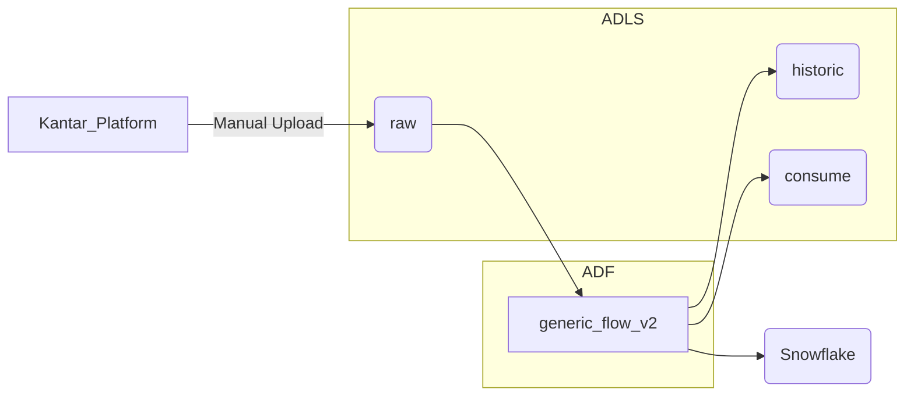

# Kantar Occasions  
This dataset contains a materialized view that provides detailed information on drinking occasions data provided by Kantar. This view is used to populate reporting tools used by the Paid Media and Innovation teams. The data is refreshed quarterly. 

### ETL
The ETL process for this data source is goverened by the generic_flow_v2 ADF pipeline (see https://dev.azure.com/abi-ghq-audit-dsc-dev-ops/beer_tech/_wiki/wikis/beer_tech.wiki/8819/Alchemy-Patterns). The pipeline brings this data from a .csv file in raw, to historic, then to consume, and finally to Snowflake. This file is expected to be uploaded once per quarter, but the pipeline configuration runs every Monday at 3a CT so as not to miss any uploads. Currently, no transformations are performed on this data; this will change in the near future to support data harmonization. 

_*ADF: generic_flow_v2 pipeline runs weekly, Monday at 3a CT_

### **[HERO.KANTAR\_OCCASIONS](https://app.snowflake.com/east-us-2.azure/abinbev_naz/#/data/databases/ABI_WH/schemas/HERO/view/KANTAR_OCCASIONS)**
This view contains consumer response data for drinking occasions. Each record specifies a KPI that is being measured, brand name, followed by the breakdown of the recorded sample.

| **Field Name** | **Data Type** | **Comment** |
| --- | --- | --- | 
|KPIS|VARCHAR()|Name of the KPI being measured 
|BRND_NM| VARCHAR()|Brand name e.g. Budweiser|
|SAMPLE1|VARCHAR()|Primary category for SAMPLE2 e.g. Age, Gender, Income|
|SAMPLE2|VARCHAR()|Secondary level breakdown for the record based on SAMPLE1 e.g. 50-65, Female|
|LEVEL_1|VARCHAR()|Frequency (Past 7 Days, Last 7 Instances, Last 2 Instances or Last 2 Occasions)|
|LEVEL_2|VARCHAR()|Primary category for LEVEL_3 e.g. Age, Gender, Income|
|LEVEL_3|VARCHAR()|Secondary level breakdown for the record based on LEVEL_2 e.g. 50-65, Female, $50K+|
|TIME_PERIOD|VARCHAR()|Time period for the sample e.g. R12M (= Rolling 12 months)|
|COUNT| VARCHAR()|Number of respondents for the category |
|PERCENTAGE|VARCHAR()|
|INDEX_TO_TOTAL|VARCHAR()|
|EDW_START_TSP|TIMESTAMP_NTZ(9)|EDW timestamp|
|EDW_LOAD_FILENAME| VARCHAR()|EDW load filename| 

Published on 11/01/2022 by Jayson Yurcho
