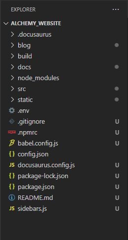
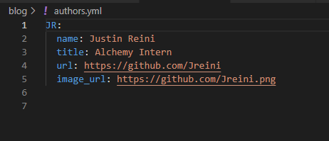

# Website Editing
This document outlines the process on how to make changes to the website

## Setting up
Follow the instructions in [How to Add Your Data Set](/docs/Certify/uploadinstructions.md) up to the section titled "Adding the data sets". From here you should see several folders with a few miscellaneous files.

Here's what the files look like in Visual Studio Code:

 

The next part of this article will explain where to find the files pertaining to different parts of the website.

## Front Page
The front page is divided into several parts.

### Header
To edit the header portion, go down the following path to find the index.js file.
```
alchemy_website/src/pages/index.js
```
This file also contains the alchemy logo at the bottom of the page, before the footer.

### Body
To edit the body, go down the following path to find the index.js file which contains the code for the body. These two files are divided up for the purpose of readability.

```
alchemy_website/src/components/HomepageFeatures/index.js
```
## Certified Sets
To edit the certified sets, navigate down the following path:
```
alchemy_website/docs/certified-sets
```
Once you enter this folder, you'll see two folders: one for US sets and another for Canada sets. <br/>
From here you should be able to find any data set you need to edit.

## Guides and Certification Instructions
In order to edit the files under the "How to Certify" tab, go down the path of:
```
alchemy_website/docs/Certify
```
Here you will find the pages with guides on certification with the example markdown document that you can download to understand the structure of a data set.

To find the documents under the "Guides" tab, you will want to follow this path:
```
alchemy_website/docs/guides
```
Here you can edit the guides and FAQ as well as adding new guides if need be.

## Release Notes
To add new posts to the "Release Notes" section, follow this path:
```
alchemy_website/blog
```
### Adding a new post
:::note
If you are a new author trying to make a post, be sure to read the next section
::: 

For adding a new post, make sure to use a markdown file with an appropriate header that lists the title, author and tags. In addition to this, the file of the post should include the date of the post. <br/>
For example, the first blog post is named:
```
2022-07-13-Welcome.md
``` 
This allows the post to be tagged with the appropriate date of posting.

### Adding a new author
First, navigate to the following file to find the current authors:
```
alchemy_website/blog/authors.yml
```
In order to add an author, follow this format and include all essential information:



- Line 1 (Username): A unique username to define your profile. This username is what should be put in the header of any blog post to specify the author.
- Line 2 (name): Add your name.
- Line 3 (url): This is the link to your GitHub account for readers to look at.
- Line 4 (image url): This is the link to your GitHub profile picture. Just add ".png" with the last link and it should easily add your profile picture.
- Line 5 (email)*optional*: Add a link to your email.

## Sidebars
To create or edit any of the sidebars navigate here:
```
alchemy_website/sidebars.js
```

## Header, Footer and Navbar
To edit many of the configurations of the website such as the navbar, the header and the footer, you will want to go down the path of:

```
alchemy_website/docusaurus.config.js
```
This file contains many overall configurations of the website and deals with links routing to other sites. If a link fails or stops working, this file is where to look for the error.